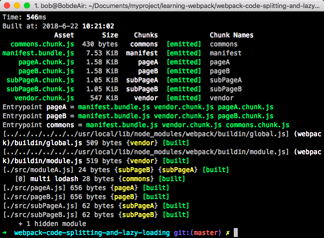

### webpack代码分割（按需加载）处理方式

```
分离业务代码和第三方依赖
分离业务代码和业务公共代码和第三方依赖
分离首次加载和访问后的加载代码
```


### 利用require.ensure()实现按需加载

```
require.ensure(
  dependencies: String[],
  callback: function(require),
  chunkName: String
)
```

- 依赖 dependencies
    - 这是一个字符串数组，通过这个参数，在所有的回调函数的代码被执行前，我们可以将所有需要用到的模块进行声明。

- 回调 callback
    - 当所有的依赖都加载完成后，webpack会执行这个回调函数。require 对象的一个实现会作为一个参数传递给这个回调函数。因此，我们可以进一步 require() 依赖和其它模块提供下一步的执行。

- chunk名称 chunkName
    - chunkName 是提供给这个特定的 require.ensure() 的 chunk 的名称。通过提供 require.ensure() 不同执行点相同的名称，我们可以保证所有的依赖都会一起放进相同的 文件束(bundle)。


### 使用require.ensure按需加载

##### 实现分别新建一个subPageA.js，subPageB.js文件，然后在app.js引入进来：

```js
import _ from 'lodash'

var page = 'subPageA'

if (page === 'subPageA') {
    require.ensure(['./subPageA'], function () {
      var subpageA = require('./subPageA')
    }, 'subPageA')

} else if (page === 'subpageA') {

    require.ensure(['./subPageB'], function () {
      var subPageA = require('./subPageB')
    }, 'subPageB')

}
export default 'pageA'
```

##### 可以将第三包或插件和其他文件分开

下面将`lodash`插件按需加载进来，并且赋予名字'vendor'，这个名字就是chunkName，分离打包的文件名字
```js
require.ensure('lodash', function () {
    var _ = require('lodash');
    _.join(['1', '2'], '3');

}, 'vendor')
```

### 使用import方法进行代码按需加载

```
import(/* webpackChunkName:'subPageA' */'./subPageA').then(function (subPageA) {
    console.log(subPageA)
})
```


具体代码，详细看文件，包括webpack里面的配置打包公共代码：

```js
// require.include('./moduleA')
import _ from 'lodash'

var page = 'subPageA'

  if (page === 'subPageA') {

  // 注释/**/是打包出来的文件名字
  import(/* webpackChunkName:'subPageA' */'./subPageA')
    .then(function (subPageA) {
      console.log(subPageA)
    })

} else if (page === 'subpageA') {

    import(/* webpackChunkName:'subPageB' */'./subPageB')
      .then(function (subPageB) {
        console.log(subPageB)
    })
}
export default 'pageA'
```



### 总结：

可以将模块，第三方包，插件进行分割打包，也可以按需打包，我们使用了2种方法进行模块按需加载方式，分别是：

```
1.利用require.ensure()实现按需加载
2.使用import方法进行代码按需加载
3.他们使用的场景功能都一样，语法不一样
```