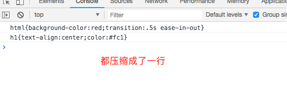
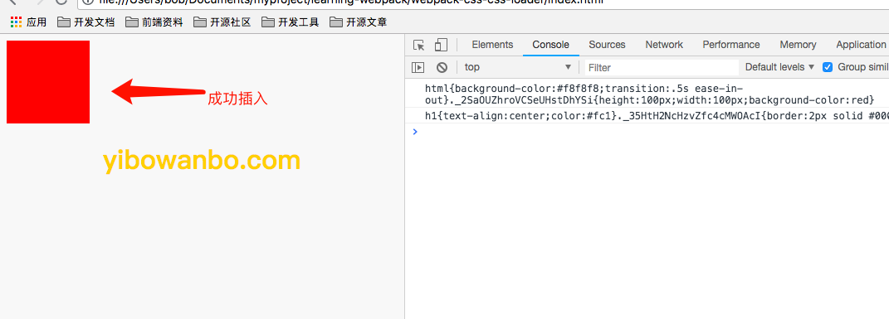
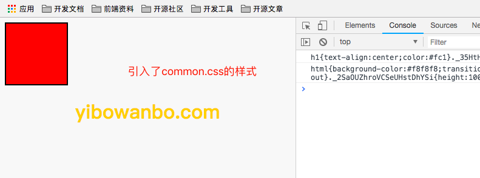
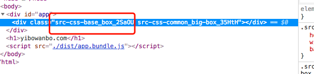

配置css-loader也有参数配置

### 一、css-loader配置参数

 ```
 - alias 解析的别名
 - importLoader (@import)
 - Minimize 是否进行css代码压缩
 - modules 是不是开启css模块化（启用css-modules）开启后，可以引入其他css文件的代码
    - :local
    - :global
    - compose
    - compose ... from path
 ```

### 二、minimize:开启压缩

css-loader可以有压缩的功能，开启minimize为true就可以了

新建了2个css文件，分别引入进行压缩

```js
minimize: true
```

详细代码

```js
module: {
    rules: [
        {
            test: /\.css$/,
            use: [
                {
                    loader: "style-loader",
                    options: {
                        // insertInto: '#app',
                        singleton: true,
                        transform: './css.transform.js'
                    }
                }, {
                    loader: 'css-loader',
                    options: {
                        // 开启压缩css
                        minimize: true,
                    }
                }
            ],
            exclude: /node_modules/,
        }
    ]
}
```



代码已经被压缩到一行，没有空格回车了


### 三、模块化:

webpack进行打包时候，一般有多少个css文件，就会自动打包多少个文件，如果使用modules就会开启css模块化，可以从A文件引入使用B文件的样式

```js
modules: true
```

详细代码
```js
module: {
    rules: [
        {
            test: /\.css$/,
            use: [
                {
                    loader: "style-loader",
                    options: {
                        // insertInto: '#app',
                        singleton: true,
                        transform: './css.transform.js'
                    }
                }, {
                    loader: 'css-loader',
                    options: {
                        minimize: true,
                        // 模块化
                        modules: true,
                    }
                }
            ],
            exclude: /node_modules/,
        }
    ]
}
```



还可以引入别的文件css

比如在common.css里的big-box
```css
.big-box {
    border: 2px solid #000;
}
```

我想在base里面进行使用

```css
.box{
    /* 这样引入也是可以的 */
    composes: big-box from './common.css';
    height: 100px;
    width: 100px;
    background-color: #f00;
}
```

看效果：



### 四、编译打包样式名字规范

webpack进行打包css样式时候，会自动转换成一串字符串，如果想对css的样式名字进行规范，可以使用localIdentName属性配置

```js
localIdentName: '[path][name]_[local]_[hash:base64:5]'
```

详细代码：

```js
module: {
    rules: [
        {
            test: /\.css$/,
            use: [
                {
                    loader: "style-loader",
                    options: {
                        // insertInto: '#app',
                        singleton: true,
                        transform: './css.transform.js'
                    }
                }, {
                    loader: 'css-loader',
                    options: {
                        minimize: true,
                        modules: true,
                        // 规范样式名字
                        localIdentName: '[path][name]_[local]_[hash:base64:5]'
                    }
                }
            ],
            exclude: /node_modules/,
        }
    ]
}
```



已经自动编译好配置规范的名字了！

### 总结：

配置css-loader时候，可以配置一些参数：

 ```
 - alias 解析的别名
 - importLoader (@import)
 - Minimize 是否进行css代码压缩
 - modules 是不是开启css模块化（启用css-modules）开启后，可以引入其他css文件的代码
    - :local
    - :global
    - compose
    - compose ... from path
 ```