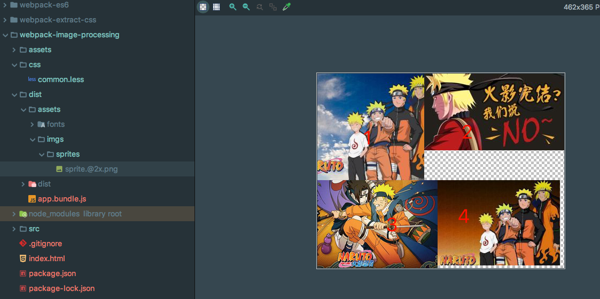
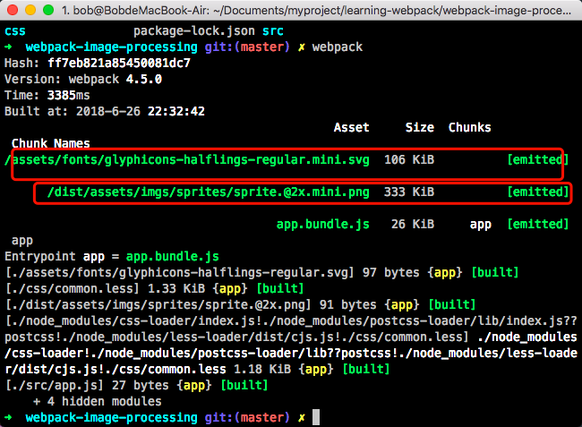

### 图片处理的场景：

- css中引入的图片
- 自动合成雪碧图
- Base64编码

### 使用的插件

- file-loader
- url-loader
- img-loader
- postcss-spriter 合成雪碧图


### 安装：

```
npm install file-loader url-loader img-loader postcss-sprites --save-dev
```

### 配置

如果我们希望在页面引入图片（包括img的src和background的url）。当我们基于webpack进行开发时，引入图片会遇到一些问题。

其中一个就是引用路径的问题。拿background样式用url引入背景图来说，我们都知道，webpack最终会将各个模块打包成一个文件，因此我们样式中的url路径是相对入口html页面的，而不是相对于原始css文件所在的路径的。这就会导致图片引入失败。这个问题是用file-loader解决的，file-loader可以解析项目中的url引入（不仅限于css），根据我们的配置，将图片拷贝到相应的路径，再根据我们的配置，修改打包后文件引用路径，使之指向正确的文件。


```js
{
    loader: 'file-loader',
    options: {
        publicPath: '',
        outputPath: '/',
        useRelativePath: true
    }
}
```


另外，如果图片较多，会发很多http请求，会降低页面性能。这个问题可以通过url-loader解决。url-loader会将引入的图片编码，生成dataURl。相当于把图片数据翻译成一串字符。再把这串字符打包到文件中，最终只需要引入这个文件就能访问图片了。当然，如果图片较大，编码会消耗性能。因此url-loader提供了一个limit参数，小于limit字节的文件会被转为DataURl，大于limit的还会使用file-loader进行copy。

```js
{
    loader: 'url-loader',
    options: {
        limit: 10000,
        name: '[name].mini.[ext]',
        publicPath: '',
        outputPath: '/',
        useRelativePath: true
    }
},
```

这里涉及到了4个参数：limit、name、outputPath、publicPath。其中limit已经说明过。file-loader相关的是name、outputPath和publicPath。下面解释一下这3个参数
    name表示输出的文件名规则，如果不添加这个参数，输出的就是默认值：文件哈希。加上[path]表示输出文件的相对路径与当前文件相对路径相同，加上[name].[ext]则表示输出文件的名字和扩展名与当前相同。加上[path]这个参数后，打包后文件中引用文件的路径也会加上这个相对路径。

outputPath表示输出文件路径前缀。图片经过url-loader打包都会打包到指定的输出文件夹下。但是我们可以指定图片在输出文件夹下的路径。比如outputPath=img/，图片被打包时，就会在输出文件夹下新建（如果没有）一个名为img的文件夹，把图片放到里面。

publicPath表示打包文件中引用文件的路径前缀，如果你的图片存放在CDN上，那么你上线时可以加上这个参数，值为CDN地址，这样就可以让项目上线后的资源引用路径指向CDN了。

###

```js
{
    loader: 'img-loader',
    options: {
        pngquant: {
            quality: 80,
        }
    }
}
```

### 压缩图片雪碧图

```js
{
    loader: 'postcss-loader',
    options: {
        ident: 'postcss',
        plugins: [
            require('postcss-sprites')({
                spritePath: 'dist/assets/imgs/sprites',
                retina: true,
            }),
            require('postcss-cssnext')()
        ]
    }
},
```

### 整个配置代码，具体看项目文件配置

```js
// webpack.config.js
var path = require('path');
module.exports = {
    mode: 'development',
    entry: {
        app: './src/app.js'
    },
    output: {
        path: path.resolve(__dirname, 'dist'),
        filename: '[name].bundle.js',
        publicPath: './dist'
    },
    module: {
        rules: [
            {
                test: /\.less$/,
                use: [
                    {
                        loader: 'style-loader',
                    },
                    {
                        loader: 'css-loader',
                    },
                    {
                        loader: 'postcss-loader',
                        options: {
                            ident: 'postcss',
                            plugins: [
                                // 配置雪碧图
                                require('postcss-sprites')({
                                    spritePath: 'dist/assets/imgs/sprites',
                                    retina: true,
                                }),
                                require('postcss-cssnext')()
                            ]
                        }
                    },
                    {
                        loader: 'less-loader',
                    },
                ],
                exclude: '/node_modules'
            },
            {
                test: /\.(eot|woff2?|ttf|svg)$/,
                use: [
                    {
                        loader: 'url-loader',
                        options: {
                            limit: 10000,
                            name: '[name].mini.[ext]',
                            publicPath: '',
                            outputPath: '/',
                            useRelativePath: true
                        }
                    }
                ]
            },
            {
                test: /\.(png|jpg|jpeg|gif)$/,
                use: [
                    // {
                    //     loader: 'file-loader',
                    //     options: {
                    //         publicPath: '',
                    //         outputPath: '/',
                    //         useRelativePath: true
                    //     }
                    // },
                    {
                        loader: 'url-loader',
                        options: {
                            limit: 10000,
                            name: '[name].mini.[ext]',
                            publicPath: '',
                            outputPath: '/',
                            useRelativePath: true
                        }
                    },
                    {
                        loader: 'img-loader',
                        options: {
                            pngquant: {
                                quality: 80,
                            }
                        }
                    }
                ]
            }
        ]
    }
}
```

### 配置处理文字

```js
{
    test: /\.(eot|woff2?|ttf|svg)$/,
    use: [
        {
            loader: 'url-loader',
            options: {
                limit: 10000,
                name: '[name].mini.[ext]',
                publicPath: '',
                outputPath: '/',
                useRelativePath: true
            }
        }
    ]
},
```



