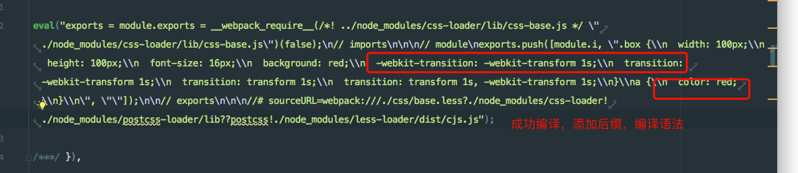

### PostCss
PostCSS是一个利用JS插件来对CSS进行转换的工具

### 参数介绍

```
postcss

postcss-loader

Autoprefixed 样式加前缀

postcss-cssnano

postcss-cssnext 可以编译一些未来的CSS样式
```

### 安装

```
npm install postcss postcss-loader autoprefixer cssnano postcss-cssnext  --save-dev
```

### 配置

```js
{
    loader: 'postcss-loader',
    options: {
        ident: 'postcss',
        plugins: [
            // 样式加前缀
            // require('autoprefixer')(),
            // 可以编译使用未来css语法
            require('postcss-cssnext')()
        ]
    }
},
```

### 测试样式

```css

.box {
  transition: transform 1s;
}

:root {
  --mainColor: red;
}

a {
  color: var(--mainColor);
}
```

### 打包结果


